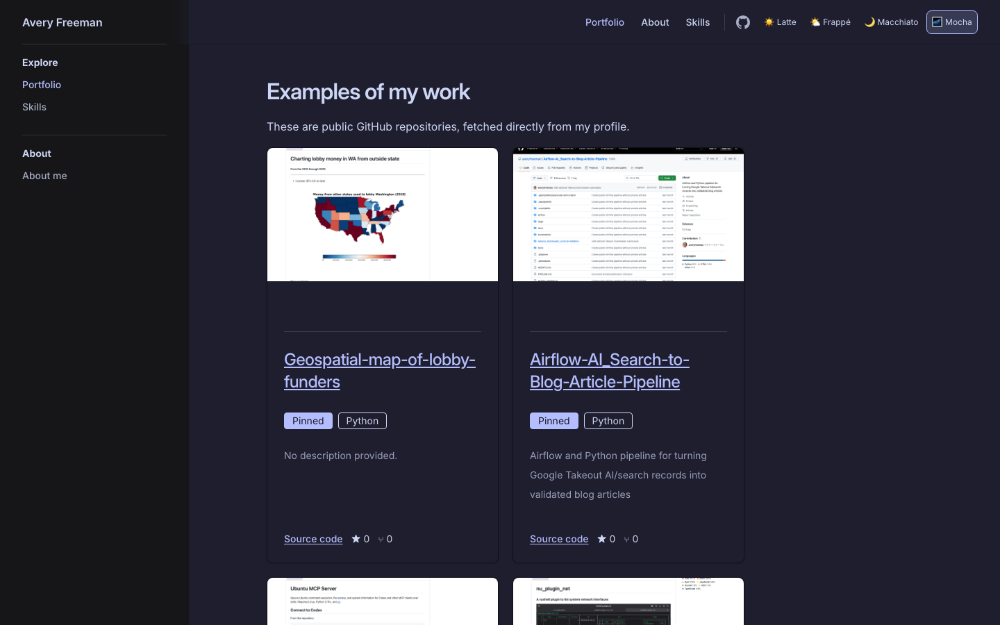

# GitHub-driven portfolio

This project is a developer portfolio built with VitePress, Vue, Tailwind CSS, and daisyUI. It automatically fetches and displays public GitHub repositories, putting a live collection of your work behind a polished, personal portfolio site.

Its primary use is as a personal portfolio. It is also a useful starting point for developers who want a unified, attractive, low-friction online portfolio without maintaining a separate project catalog by hand.



## Setup

The required workflow uses only Node.js and npm. Use a current Node.js release with npm installed.

Install the dependencies:

```bash
npm install
```

Configure `docs/user-attributes.yaml` with your GitHub username. This is the complete required configuration:

```yaml
github:
  username: your-github-username
```

Start the development server, build the production site, or preview the production build with these commands:

```bash
npm run docs:dev
npm run docs:build
npm run docs:serve
```

`docs:dev` starts the VitePress development server. `docs:build` writes the static site to `docs/.vitepress/dist`, which can be deployed to a static host. Run `docs:serve` after a production build to inspect that output locally.

### Generated profile data and local overrides

At development and build time, the site fetches supported public GitHub profile fields and uses them as generated defaults. If GitHub is unavailable or rate-limits the request, the site falls back to the username, local values, and built-in defaults so the configuration remains usable.

Add authored values to `docs/user-attributes.yaml` when you want to override generated data or customize the site. Local values win, including intentionally empty values, and the development server and production build never write to the YAML file. For example:

```yaml
github:
  username: your-github-username
  name: Your Name
  bio: A short introduction.

profile:
  role: Product-minded engineer

site:
  title: Your Name — Portfolio
```

Profile synchronization is explicit. Run this command when you want missing supported GitHub fields materialized into `docs/user-attributes.yaml`:

```bash
npm run profile:sync
```

Synchronization adds missing fields only. It preserves local overrides, empty values, and custom YAML fields; it is not part of `docs:dev` or `docs:build`.

## Optional repository README previews

Repository cards can include cached screenshots of each repository's rendered GitHub README. Install the Playwright Chromium browser once, then generate the previews:

```bash
npx playwright install chromium
npm run repos:previews
```

Images are stored in `docs/public/repository-previews/` and reused on later runs, so the generator does not recapture an existing preview by default. Refresh all cached images with:

```bash
npm run repos:previews -- --force
```

Pinned GitHub repositories are sorted to the top of the portfolio automatically. Preview generation is optional; cards show a fallback message when an image is unavailable.

## Customization

- Homepage copy, profile details, feature cards, portfolio text, status messages, footer text, and site metadata are configured in `docs/user-attributes.yaml`. The defaults live in `docs/user-attributes.data.js`.
- `docs/about.md` and `docs/skills.md` are regular Markdown pages. Add more `.md` pages under `docs/` when you need long-form content.
- Top navigation is controlled by `site.nav` in `docs/user-attributes.yaml`; the sidebar structure is defined in `docs/.vitepress/config.js`.
- The theme selector supports Catppuccin Latte, Frappé, Macchiato, and Mocha. Set the initial theme with `theme.default`; the visitor's later selection is persisted in the browser.
- GitHub's pinned repositories are promoted in their pinned order. To author a different order locally, add an optional `github.pinnedRepositories` list containing repository names or `owner/name` values.

  ```yaml
  github:
    username: your-github-username
    pinnedRepositories:
      - owner/first-repository
      - owner/second-repository
  ```

- README preview assets are looked up by lower-case owner/name slugs such as `docs/public/repository-previews/owner--repository.png`. Use `npm run repos:previews` to create them rather than editing card markup.

## DaisyUI MCP (optional)

The `daisyui-mcp/` directory is not required to install, develop, build, or deploy the portfolio. It is an optional AI-assisted DaisyUI documentation helper for looking up component guidance during design and development.

If you want to use it, install `uv`, then run it from its directory:

```bash
cd daisyui-mcp
uv sync --python 3.12
uv run daisyui-mcp
```

The portfolio itself uses the npm `daisyui` package. The Python MCP server is separate design-time tooling.

## FAQ and troubleshooting

### Can I use username-only setup?

Yes. A `github.username` value in `docs/user-attributes.yaml` is enough to run the site. GitHub profile fields and pinned repository ordering are generated when available; everything else comes from local values or defaults.

### How do profile synchronization and overrides interact?

`npm run profile:sync` explicitly fetches the public profile and writes only missing supported GitHub fields. It does not overwrite an existing local value, even when that value is empty, and it never removes custom YAML fields.

### What if GitHub rate-limits requests or profile data is unavailable?

Profile generation falls back to the username, authored values, and built-in defaults. The portfolio page still reports repository API rate limits or unavailable data with a retry action; try again later or provide the copy you want locally.

### Why are repository previews missing?

Install Chromium with `npx playwright install chromium`, then run `npm run repos:previews`. A card displays `README preview unavailable` when its cached asset is missing or could not be loaded.

### How do I refresh cached screenshots?

Run `npm run repos:previews -- --force`. Without `--force`, existing files in `docs/public/repository-previews/` are kept.

### Why did my selected theme persist?

The theme selector stores the choice in browser local storage. Clear this site's storage to reset it to `theme.default`; the default only applies when no saved theme exists.

### Do I need DaisyUI MCP?

No. `daisyui-mcp/` is optional and is not needed for npm installation, local development, builds, or deployment. The portfolio uses the npm `daisyui` package directly.
